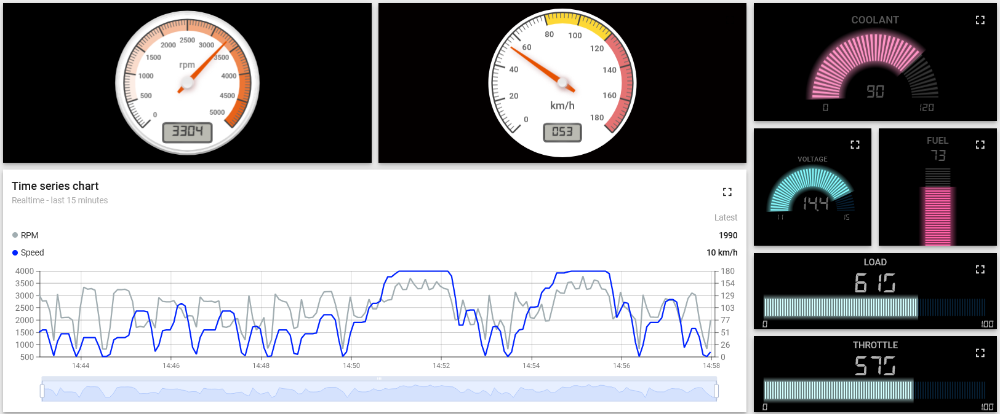
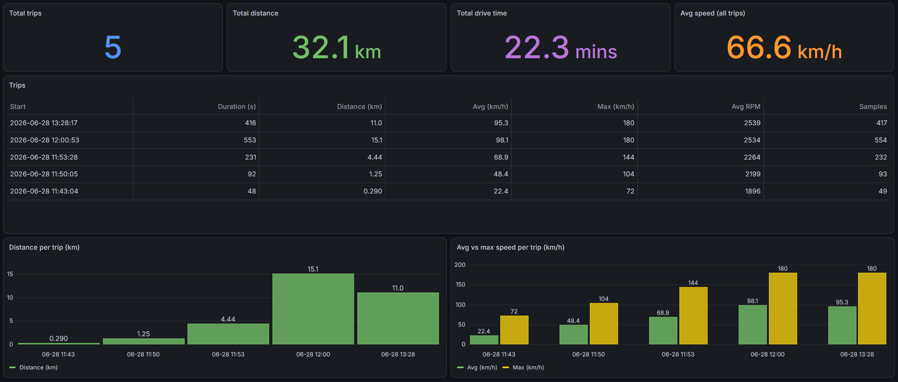
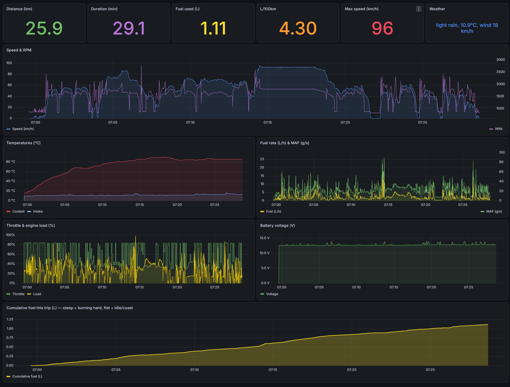

# Smart Car — OBD-II Trip Logger

An end-to-end car **trip logger**: an ESP32 reads live OBD-II data from the car
over Bluetooth, streams it through the phone's 4G hotspot to a self-hosted
IoT stack, and every trip becomes a row of history — distance, speed, fuel
consumption, and the weather it was driven in. Verified on a real car.

```
       CAR                    ESP32 (WROOM-32)           phone hotspot (4G)
 ┌────────────┐   BT Classic  ┌────────────────┐   WiFi ┌──────────────────────────────┐
 │   ELM327   │──────SPP─────►│ ELM327Source   │──TLS──►│  VPS (Docker)                │
 │ (OBD port) │               │  or Simulator  │  8883  │                              │
 └────────────┘               │  → MQTT/JSON   │        │  Mosquitto (MQTT broker)     │
                              └────────────────┘        │    ├─► Node-RED              │
   Simulator = same interface, no car needed            │    │    ├─► ThingsBoard      │
                                                        │    │    │   (live gauges)    │
                                                        │    │    └─► PostgreSQL       │
                                                        │    │        telemetry + trips│
                                                        │    └ trip end ─► n8n webhook │
                                                        │                └► Open-Meteo │
                                                        │  Grafana ◄── PostgreSQL      │
                                                        │  (trip comparison dashboard) │
                                                        └──────────────────────────────┘
```

## What it does

- **Live telemetry** (1 Hz): RPM, speed, coolant/intake temps, throttle, engine
  load, battery voltage, fuel level, MAF, fuel rate → ThingsBoard gauges
- **Trip logging**: each power-on is a trip; at trip end Node-RED computes a
  summary row — duration, distance (∫speed), avg/max speed & RPM,
  **fuel used and L/100km** (∫fuel rate)
- **Weather enrichment**: at trip end, n8n fetches Open-Meteo and stamps the trip
  with temperature, wind, and conditions — enabling "does winter hurt my fuel
  economy?" analysis
- **Trip comparison**: Grafana dashboard (auto-provisioned from this repo) with
  totals, a trips table, and per-trip distance/speed/fuel charts

## Dashboards

Live ThingsBoard gauges (driven by the simulator here — same pipeline as the car):



Grafana trip comparison, one row per trip:



Per-trip deep-dive — second-by-second replay of a single drive (speed/RPM,
temperatures, fuel rate, cumulative fuel, throttle/load, voltage):



## Design notes

**Swappable data source.** The firmware programs against
[`ITelemetrySource`](include/ITelemetrySource.h); the concrete source is either
[`SimulatorSource`](src/SimulatorSource.cpp) (realistic drive-cycle generator —
the entire pipeline was built and demoed before ever touching the car) or
[`ELM327Source`](src/ELM327Source.cpp) (real OBD via Bluetooth Classic +
[ELMduino](https://github.com/PowerBroker2/ELMduino)). One `config.h` flag flips
between them; nothing downstream knows the difference.

**Coexistence on a small chip.** Bluetooth Classic + WiFi + TLS barely fit in the
ESP32's RAM. The firmware connects MQTT *before* starting Bluetooth (a full TLS
handshake needs contiguous heap that no longer exists once BT is up), releases
the unused BLE stack, and — if MQTT is ever stuck after a link drop — reboots to
recover, preserving the trip ID in RTC memory so the drive stays one trip.

**Diesel fuel math.** Fuel comes from PID 015E (direct fuel rate) when the car
supports it. The MAF fallback does *not* assume stoichiometric AFR — diesels run
lean (AFR ~15–80 depending on load), so AFR is estimated from engine load.

**Remote diagnostics.** The device publishes its state (`obd-ready`,
`bt-connect-failed`, …) and Bluetooth scan results to retained MQTT topics —
every in-car failure was debugged from a desk, no laptop in the car.

## Repo layout

| Path | What |
|---|---|
| `src/`, `include/` | ESP32 firmware (PlatformIO, Arduino framework) |
| `db/schema.sql` | PostgreSQL schema: raw `telemetry` + per-trip `trips` |
| `nodered/trip-logger-flow.json` | Node-RED flow: ingest → Postgres, trip-end summary, weather |
| `n8n/trip-weather-workflow.json` | n8n webhook → Open-Meteo weather service |
| `grafana/provisioning/` | Auto-provisioned datasource + trips dashboard |
| `PROJECT_PLAN.md` | Phased roadmap with status |

## Hardware

- ESP32 **WROOM-32** dev board (must be the original chip — Bluetooth Classic;
  S2/S3/C3 are BLE-only and cannot talk to cheap ELM327 dongles)
- ELM327 Bluetooth OBD-II adapter (connect by MAC + PIN `1234`)
- Power: USB power bank / car USB (12V→5V buck off the OBD port planned)
- *(planned)* u-blox NEO-6M/M8N GPS module for route maps

## Build & flash (PlatformIO)

```
cp include/config.example.h include/config.h   # then fill in your values
pio run -t upload
pio device monitor
```

`config.h` (git-ignored) holds WiFi, MQTT credentials, the ELM327 MAC/PIN, and
the `USE_ELM327` simulator/real switch. The payload is flat JSON on
`smartcar/telemetry`:

```json
{"trip_id":"trip-1783051504","ts":1783051519000,"rpm":1840,"speed":42.3,
 "coolant":88.1,"intake":31.2,"throttle":24.0,"load":35.1,"voltage":14.21,
 "fuel":74.6,"maf":12.4,"fuel_rate":2.31}
```

## Security

- MQTT is TLS-only on the internet (Let's Encrypt, port 8883, password auth);
  plain 1883 is loopback-only on the VPS
- The firmware pins Let's Encrypt **roots** (not the leaf), so cert renewals
  need no firmware update; NTP sync before the first handshake
- Grafana/Postgres/Node-RED are not exposed publicly (SSH tunnel / loopback)
- All credentials live in git-ignored local files

## Status & roadmap

Working end-to-end on a real car (diesel): trips log with zero data gaps,
fuel-accuracy fix awaiting road verification. Next: GPS route maps, commute/route
analysis, car-health trends (warm-up time, battery voltage, idle drift, DTC
alerts). Full plan in [PROJECT_PLAN.md](PROJECT_PLAN.md).
